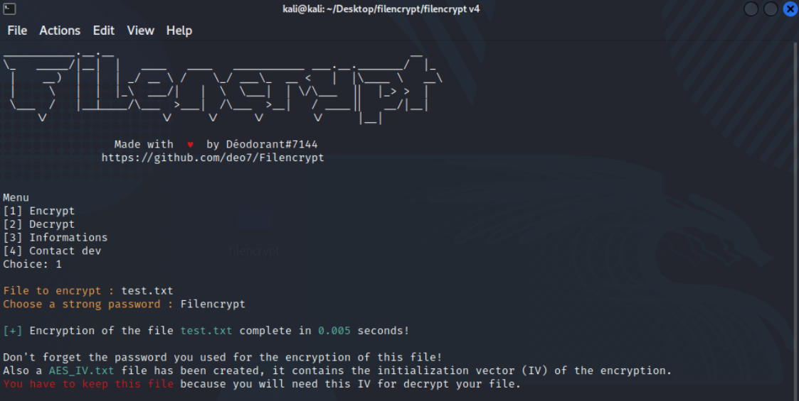
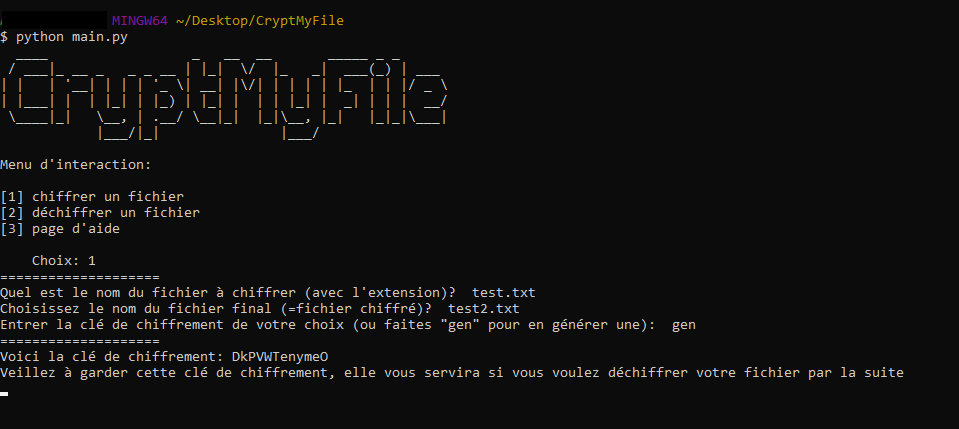
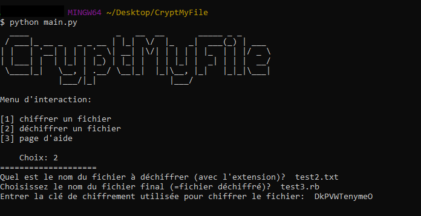

# Filencrypt v4.0 💖
Filencrypt is a cryptography project started in 2021 that encrypts and decrypts your files of all extensions (txt, js, png...) in AES-256 CBC Mode. Filencrypt works with a password chosen by the user and with an initialization vector (IV) generated by the program.

# Use 💻
## Installation
```bash
git clone https://github.com/deo7/Filencrypt.git
cd Filencrypt
pip install -r requirements.txt
```

## Run
Windows :
```
python filencrypt.py [-h] [-e] [-d] [-i] [-c]
```

Linux :
```
python3 filencrypt.py [-h] [-e] [-d] [-i] [-c]
```

# Demonstartion 📸


As you can see above, I encrypt a 'test.txt' file with the password 'Filencrypt'. Thus, the original content of this file become encrypted and unreadable. <br />
The program creates a file 'AES_IV.txt' containing the initialization vector (IV) used for the AES encryption of THIS file (and only this file, a file encryption -> a new IV generated). The IV is a 128 byte block uses by AES-256 CBC Mode for encryption.<br />
AES_IV.txt file :



Finally, I decrypt my file with the password AND initialization vector (see below).<br />
- WARNING : If you decrypt your file with an incorrect password / IV, you will get errors and incorrect decryption.



To conclude, here is a table that resume the encryption and the decryption of 'test.txt' :

| Original file content | Encrypted file content (with my password and my IV) | Decrypted file content |
| :---                  |     :---:                                           |                   ---: |
| Hello world !         | ßCå2µÄ£ËÅPð                                    | Hello world !          |

# Other 📚
<p align="center">
  
  
  <br />
  
  
  
</p>
