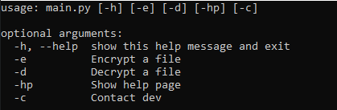
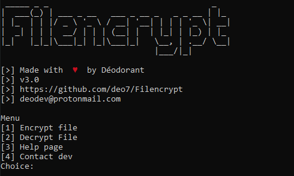
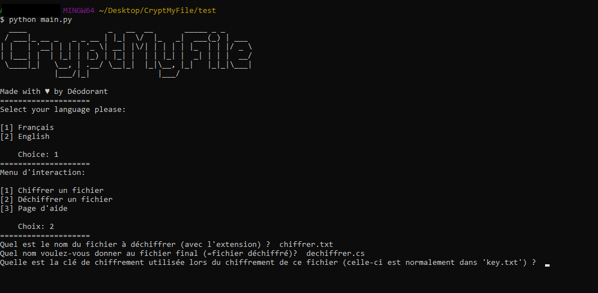
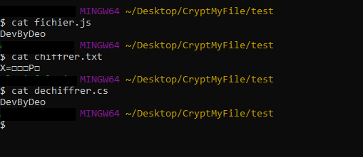
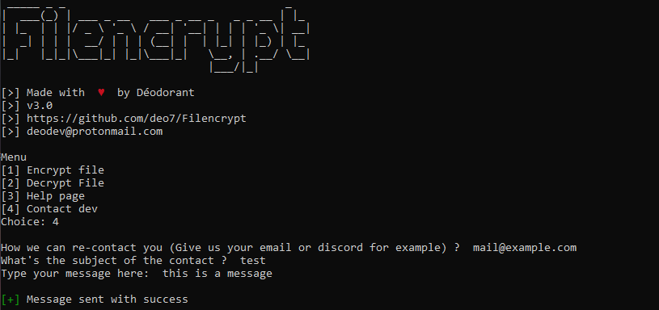
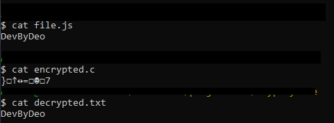

# Filencrypt v3.0 💖
Filencrypt encrypts and decrypts your files of all types (png, js, txt ...) in XOR with a generated encryption key of 3000 characters (subsequently hashed in sha-256)

# Installation 🛠
```bash
git clone https://github.com/deo7/Filencrypt.git
cd Filencrypt
pip install -r requirements.txt
```

# Use 💻
## Run
```python
python main.py [-h] [-e] [-d] [-hp] [-c]
```
## Tips
* Make sure to put the main file 'main.py' in the same folder as the file to be encrypted / decrypted

* Don't forget the extension (txt, html, rb,...)  when the program asks you for the file name

* If you want to decrypt a file, be sure to use the same key used when encrypting it (this is in 'key.txt')

More informations in the Filencrypt help page

# Demonstartion 📸






As you can see above I have chosen to encrypt a 'file.js' file within an 'encrypted.c' file, basically the content of 'file.js' will be encrypted and then written to 'encrypted.c'. I could very well have changed the extension and chose from encrypted 'file.js' to 'encrypted.rb' for example.



I then chose to decrypt my 'encrypted.c' file to a text file, 'decrypted.txt'. To do this, I restart the program with `python main.py` (`python main.py -d` is also good) then I selected `2` to decrypt my file.

Warning: for the decryption to be correct I used the same key as for encrypting the file. This encryption key is 3000 characters long and is automatically generated by the program when encrypting your file, it is then written to a file called 'key.txt' in the same folder where 'main.py' is. If the encryption key is incorrect, your file will be decrypted incorrectly.



If you want to contact me you can do it directly from the program by running `python main.py -c`. You can also contact me by mail or discord.



To conclude, here is a `cat` of all the files, the starting file 'file.js', then the encrypted file 'encrypted.c', and finally the decrypted file 'decrypted.txt'.

# Legal 🎓
In accordance with the GNU General Public License v3.0, and as explicitly stated in it, you have permissions and obligations towards this project which you can find [right here](https://choosealicense.com/licenses/gpl-3.0/)

# Contact 📩
You can contact me:
* Directly by the program, by running `python main.py -c` :)
* By Discord: Déodorant#7144
* By email: deodev@protonmail.com
