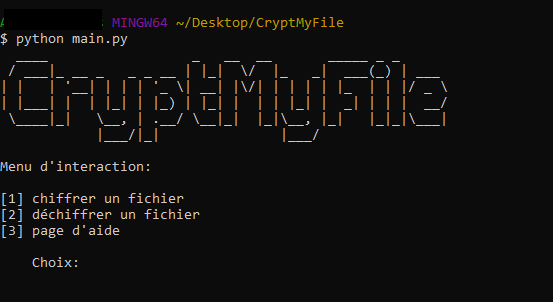

# CryptMyFile 💖
CryptMyFile chiffre et déchiffre vos fichiers de tous types (png, js, txt...) en XOR avec la clé de chiffrement de votre choix ou une clé de chiffrement générée

# Installation 🛠
```bash
git clone https://github.com/deo7/CryptMyFile.git
cd CryptMyFile
pip install -r requirements.txt
```

# Utilisation 💻
## Run
```python
python main.py
```
## Conseils
* Veillez bien à mettre le fichier main.py dans le même dossier que le fichier à chiffrer

* N'oubliez pas l'extension lorsque le programme vous demande le nom du fichier

* Si vous voulez déchiffrer un fichier, veillez à utiliser la même clé utilisée lors du chiffrement de celui-ci

Plus d'infos dans la partie aide du programme

# Demonstartion 📸



Comme vous pouvez le voir ci-dessus j'ai choisis de chiffrer un fichier test.txt dans un fichier test2.txt, en gros le contenu de test.txt va être chiffré puis écrit dans test2.txt. J'aurais très bien pu changer l'extension et choisir de chiffré test.txt vers test2.cs.


J'ai ensuite choisis de déchiffrer mon fichier test2.txt vers un fichier Ruby, test3.rb. Pour ce faire, j'ai relancer le programme avec `python main.py` puis j'ai sélectionné `2` pour déchiffrer mon fichier.

Attention: pour que le déchiffrement soit correcte j'ai utilisé la même clé que pour chiffrer le fichier (celle générée). Vous pouvez donc constater que la clé de chiffrement générée dans la seconde image est similaire à celle que j'ai utilisé pour déchiffrer test2.txt dans l'image ci-dessus.

# Légal 🎓
Conformément à la license GNU General Public License v3.0, et comme explicitement indiqué dans celle-ci, vous avez des autorisations et des obligations vis-à-vis de ce projet que vous pouvez retrouver [juste ici](https://choosealicense.com/licenses/gpl-3.0/)

# Contact 📩
Vous pouvez me contacter
* Via Discord: Déodorant#7144
* Par mail: deodev@protonmail.com
